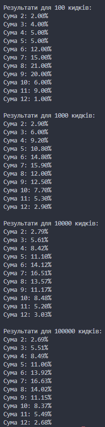

Завдання 7 використовує метод Монте-Карло для симуляції ймовірностей сум при киданні двох кубиків.

Після виконання великої кількості симуляцій (від 100 до 100000), отримані емпіричні ймовірності поступово збігаються з теоретичними значеннями:

- Найбільш ймовірна сума — 7 (~16.67%)
- Найменш ймовірні — 2 і 12 (~2.78%)

Результати підтверджують правильність розрахунків методом Монте-Карло, оскільки за великих обсягів кидків результати близькі до аналітичних.

